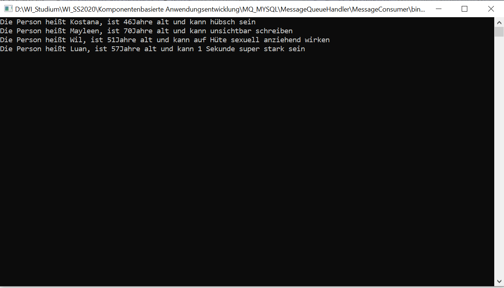

# People with Superpowers

## Message Queue and MySQL Connection with C

Little Side-Project with C#.
Basically just playing around, creating Objects (in this case Persons with Superpowers and Age), then having 2 console applications, one Provider that creates and adds Objects to a Message-Queue and saves them in a MySQL-Database, and one Consumer that reads the Queue.

Thats basically it, just for reference, if I ever need one of those things in the future again.

## How it works:

### before Executing

Message Queue

MySQL Table

### executing

First start Provider

This will add to the Message Queue:

And to the Database:

Then start the Consumer:

After this, Message Queue is empty again:

Magic, i tell you!
